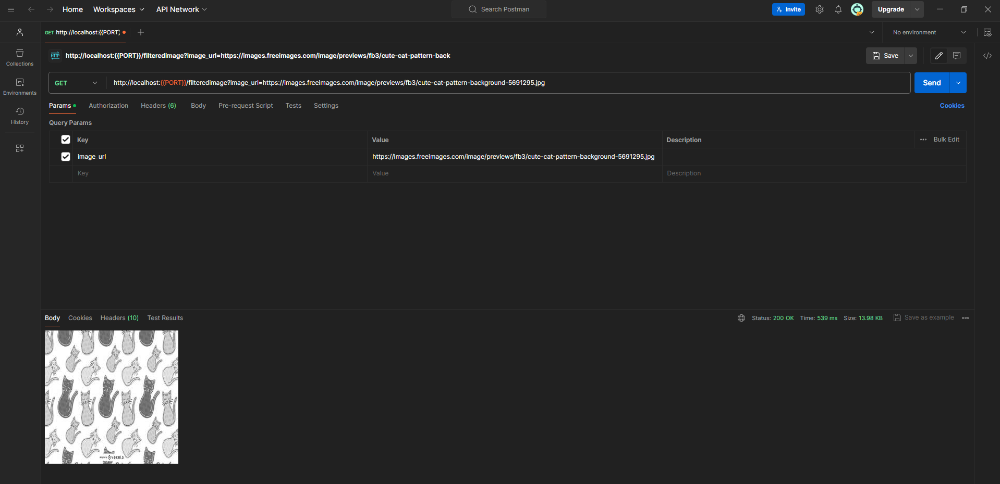
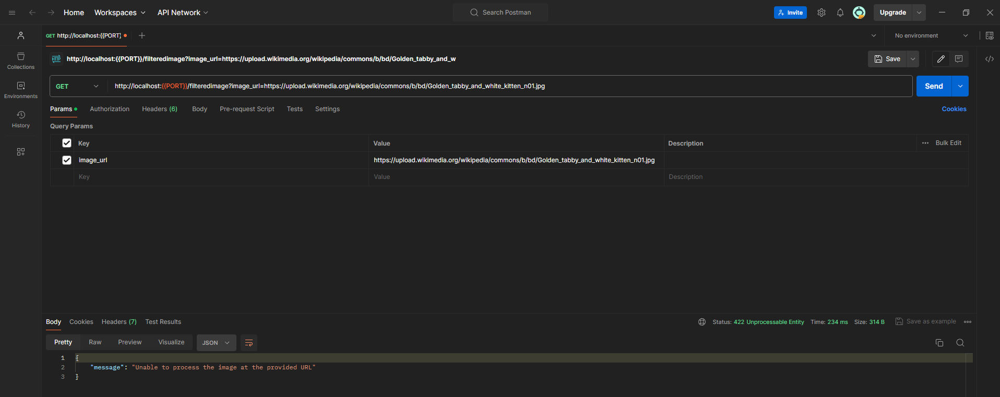
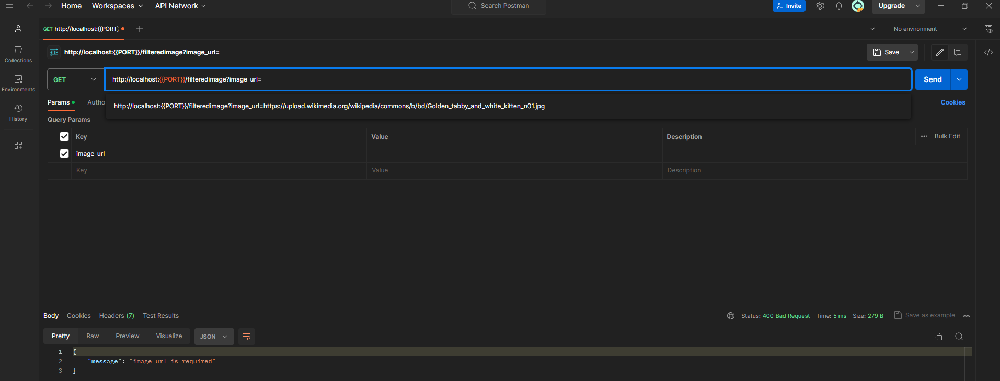
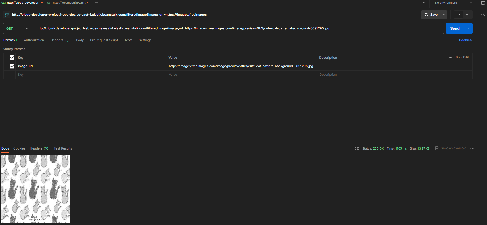
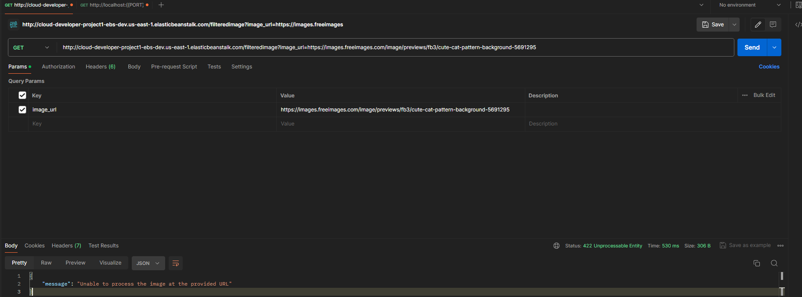
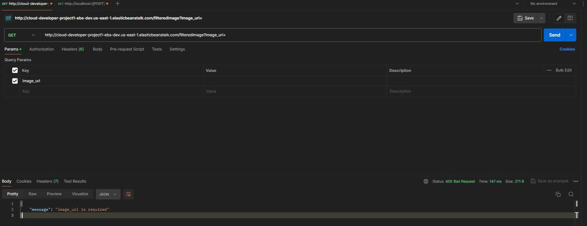

# Full Stack Apps on AWS Project

This is a first project of [Udacity Cloud Developer Nanodegree](https://www.udacity.com/course/cloud-developer-nanodegree--nd9990).

## Quick start in local env

`npm i && npm run dev`

## Elastic Beanstalk

It is available as Elastic Beanstalk application at http://cloud-developer-project1-ebs-dev.us-east-1.elasticbeanstalk.com/, created with ` eb init` and `eb create` commands.

## Testing Your Application

POSTMAN is recommended for API testing.

1. Response with 200 code in local env 
2. Response with 422 code in local env 
3. Response with 400 code in local env 
4. Response with 200 code in eb env 
5. Response with 422 code in eb env 
6. Response with 400 code in eb env 

## Made with

1. [Visual Studio Code](https://code.visualstudio.com/)
2. [Node.js](https://nodejs.org/en) and following npm packages:

- [Express](https://expressjs.com/)
- [body-parser](https://www.npmjs.com/package/body-parser)
- [Jimp](https://github.com/jimp-dev/jimp)

3. [Postman](https://www.postman.com/)
4. [AWS CLI](https://aws.amazon.com/cli/)
5. [EB CLI](https://docs.aws.amazon.com/elasticbeanstalk/latest/dg/eb-cli3.html)
6. [AWS Elastic Beanstalk](https://docs.aws.amazon.com/elasticbeanstalk/latest/dg/Welcome.html)

## License

[License](LICENSE.txt)
